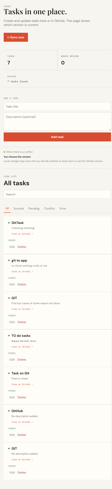

# Task Sync

Task Sync is a React/Vite dashboard and Node.js/Express API that keeps application tasks bidirectionally synchronized with GitHub Issues. PostgreSQL stores durable task, queue, webhook, conflict, and cursor data.

## Architecture overview

```text
React/Vite dashboard
	|
	| REST: tasks, sync, conflicts
	v
Node.js + Express API ---- GitHub Issues API
	|
	v
PostgreSQL (tasks, sync events, jobs, conflicts, cursor)
```

- `frontend/src/App.jsx` owns the task dashboard and honest loading, error, sync, and conflict states.
- `backend/server.js` exposes the REST API and verifies GitHub webhook signatures.
- `backend/syncEngine.js` applies the bidirectional sync policy and conflict decisions.
- `backend/githubProvider.js` is the authenticated GitHub client with pagination, timeout, retry, and rate-limit handling.
- `backend/postgresStore.js` persists the in-memory engine snapshot to normalized PostgreSQL tables in one transaction.
- `backend/db/migrations/` contains ordered, repeatable database migrations.

## Database schema

- `tasks`: local task fields, version, timestamps, provider issue number/metadata, sync status, errors, and deletion tombstones.
- `sync_events`: processed `X-GitHub-Delivery` IDs used for webhook idempotency.
- `sync_jobs`: pending/error task work and retry metadata.
- `sync_conflicts`: local and GitHub versions captured for manual resolution.
- `sync_state`: the incremental GitHub pull cursor.
- `schema_migrations`: applied migration filenames.

The migration runner creates these tables on startup. Run it directly with `npm run migrate`.

## Run it locally

You need Node 18 or newer, PostgreSQL 14 or newer, and a GitHub personal access token with permission to read and write Issues in the repository you want to use.

```powershell
cd backend
copy .env.example .env
# Edit .env and fill in the GitHub and PostgreSQL values
npm install
npm start
```

In a second terminal:

```powershell
cd frontend
npm install
npm run dev
```

Open `http://127.0.0.1:5173/` in a browser. The API runs on `http://localhost:5000` by default.

### Environment variables

Copy `backend/.env.example` to `backend/.env`, then replace the placeholders. Never commit `backend/.env`.

| Variable | Purpose |
| --- | --- |
| `GITHUB_TOKEN` | GitHub personal access token; kept local and never committed |
| `GITHUB_OWNER` | GitHub repository owner |
| `GITHUB_REPO` | GitHub repository name |
| `GITHUB_WEBHOOK_SECRET` | Random value shared with the GitHub webhook |
| `DATABASE_URL` | PostgreSQL connection string |
| `DB_POOL_MAX` | Maximum PostgreSQL connections, normally `10` |
| `GITHUB_REQUEST_TIMEOUT_MS` | Provider request timeout, normally `10000` |
| `PORT` | Backend port, normally `5000` |

For a local webhook, expose the backend with `ngrok http 5000` and configure `https://<ngrok-host>/api/webhooks/github` in GitHub. Select `application/json`, enable SSL verification, and subscribe to **Issues** only.

## Sync flow

1. A task created or edited in the app is saved as `pending` with a version number.
2. **Sync now** pushes pending tasks in order. New issues include a private task ID marker; existing tasks use the stored GitHub issue number.
3. Successful provider responses store the issue number, `updated_at`, URL, and `synced` status.
4. GitHub changes arrive through signed webhooks or the incremental pull. The pull sends the saved cursor as GitHub's `since` filter and updates the cursor only after a completed pull.
5. A provider change for an unknown issue creates one local task. A matching pending local edit becomes a conflict instead of being silently overwritten.
6. Failed work is marked `error`, persisted, and retried on a later sync; one failed task does not stop the rest.

## API surface

- `GET /api/health`
- `GET /api/tasks?search=<text>&status=<sync-status>`
- `GET /api/tasks/:id`
- `POST /api/tasks`
- `PATCH /api/tasks/:id` with optional `If-Match` version
- `DELETE /api/tasks/:id` with optional `If-Match` version
- `POST /api/sync`
- `GET /api/tasks/:id/conflict`
- `POST /api/tasks/:id/resolve` with `{ "choice": "local" | "remote" }`
- `POST /api/webhooks/github`

### One-command setup

On Windows, install Node.js 18+ and PostgreSQL first, then run PowerShell from the repository root:

```powershell
Set-ExecutionPolicy -Scope Process Bypass
.\setup.ps1
```

The script installs backend and frontend dependencies, creates `backend/.env` from the example when needed, verifies PostgreSQL, and opens the backend and frontend in separate PowerShell windows. Fill in `backend/.env` when prompted. It does not install PostgreSQL itself because PostgreSQL requires a system installer and password setup.

For webhooks, create a GitHub webhook for `/api/webhooks/github`, choose `application/json`, and use the same random value as `GITHUB_WEBHOOK_SECRET` in `.env`. The endpoint accepts only GitHub requests with a valid `X-Hub-Signature-256` header.

The backend uses PostgreSQL when `DATABASE_URL` is configured. Migrations create `tasks`, `sync_events`, `sync_jobs`, `sync_conflicts`, and `sync_state`; migrations run automatically on startup and can also be run with `npm run migrate`. Existing legacy JSONB state is imported once when present. The file-backed store remains available for isolated unit tests when no database URL is provided.

## How it works

The GitHub API code lives in `backend/githubProvider.js`. It adds the access token to each request, reads Issues 100 at a time, ignores pull requests, and retries temporary network failures, request timeouts, 429, rate-limit 403, and 5xx responses. Requests abort after `GITHUB_REQUEST_TIMEOUT_MS` (10 seconds by default). The retry delay uses GitHub's `Retry-After` or reset header when available. New issues include a private task ID marker, so a retry after a network timeout can find an issue that GitHub already created instead of creating another one.

`backend/syncEngine.js` handles the actual sync work. A new or edited task is saved as `pending`. A sync pushes pending tasks first, then reads the provider pages and updates local tasks. The last completed pull time is saved as a cursor so the process can restart without losing its place.

A task that repeatedly fails is marked `error`; it does not stop the other tasks from syncing. The dashboard shows that state instead of claiming the task is synced. App deletes close the matching GitHub issue and keep a local tombstone so late events cannot recreate it.

## Conflict handling

This project uses manual conflict resolution. When a local edit is still pending and GitHub has a different newer version, the task becomes `conflict`. Both versions are retained in `conflict.local` and `conflict.remote`, viewable through `GET /api/tasks/:id/conflict` and in the dashboard. The user can keep the local version, which is pushed to GitHub, or use the GitHub version, which is adopted locally. This avoids silently overwriting either side.

Manual resolution is deliberate here. It prevents an edit from disappearing silently. A field-by-field merge would be a useful next step, but it would need rules for cases where both sides changed the same field.

### Conflict policy

There is no automatic winner when both sides changed during an offline window. The local and provider versions are shown together and the user chooses. Choosing **local** pushes the local version to GitHub; choosing **GitHub** adopts the provider version locally. This policy is slower than last-write-wins, but it avoids silently losing a user edit and makes the trade-off visible.

## How I ensured sync correctness

- **Concurrent edits:** each task has a version number. PATCH and DELETE requests can include `If-Match`; an old version receives HTTP 409 instead of overwriting a newer edit. The concurrent update test proves that exactly one of two requests using the same version wins. State writes are queued and written through a temporary file before the file is replaced; PostgreSQL persistence uses a transaction.
- **Duplicate events:** GitHub delivery IDs are stored in `events`. Receiving the same webhook again returns `duplicate: true` and does not apply the event twice. GitHub issue numbers are used as the stable provider ID.
- **Deleted tasks:** a local delete leaves a tombstone. A late webhook for that issue is ignored, so an old event cannot bring the task back.
- **Retries:** temporary provider and network failures are retried up to five times. A permanent failure is recorded on that task and the rest of the queue can continue; a later sync retries tasks in the `error` state. Pending work remains on disk if the process stops, and the pull checkpoint is sent to GitHub as a `since` filter on the next run.

## Tests

```powershell
cd backend
npm.cmd test
npm.cmd run migrate

cd ..\frontend
npm.cmd run lint
npm.cmd run build
```

The 15 backend tests cover API CRUD/status codes, duplicate webhooks delivered three times, deleted-task tombstones, stale concurrent updates, conflict detection and both resolutions, pagination, rate limits, 429/5xx/network/timeout retries, duplicate issue recovery, deletion propagation, and restart/cursor persistence.

## Submission verification

From a clean checkout, install PostgreSQL and Node.js, copy `.env.example`, fill in credentials, and run `setup.ps1`. The script installs both dependency sets, verifies the database, and opens the backend and frontend. Then run the commands above and open `http://localhost:5173`.

Do not include `.env`, `node_modules`, `frontend/dist`, or runtime state in a submission archive. `.env.example`, migrations, tests, and README are intended to be committed.

## Screenshot



The screenshot shows the running dashboard with task counts, Sync now, task creation, search, status filters, and synchronized GitHub-backed tasks.

## Known limitations

The PostgreSQL store keeps an in-memory snapshot for the existing sync engine and persists normalized records in one transaction. `pushPending()` uses a PostgreSQL advisory lock, so separate backend processes cannot process the sync queue at the same time; the in-process `running` guard handles re-entry within one process. The current pull uses GitHub's `since` filter but still needs to scan each changed page; using GitHub events or conditional requests would make large repositories more efficient.

With more time, I would add PostgreSQL integration tests in CI, worker leases for multi-process queue consumers, API pagination for very large local task lists, authentication for dashboard users, structured logging/metrics, and field-level conflict merging. The current design is intentionally explicit about these boundaries rather than claiming multi-worker guarantees it does not provide.
